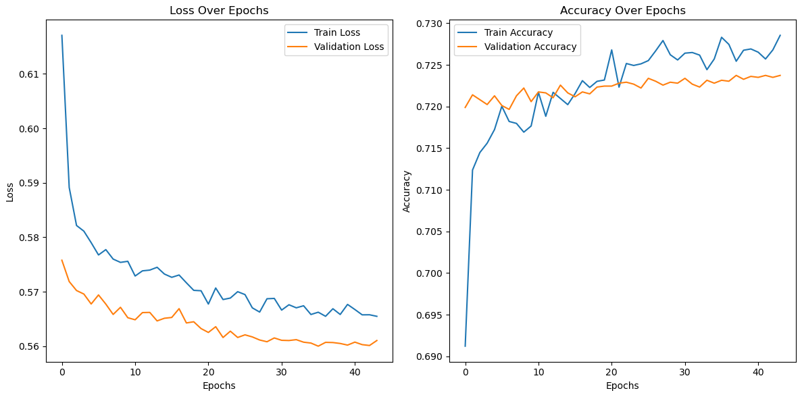

ALPHABET SOUP DEEP LEARNING CHALLENGE
=======================================

Overview
--------
The purpose of this project is to create and optimize a deep learning model to predict whether organizations funded by Alphabet Soup will be successful. The model leverages a dataset containing metadata about more than 34,000 organizations to create a binary classifier. In this repository, you will find Jupyter/Colab notebooks with code for data preprocessing, model building, optimization, and evaluation, along with this comprehensive report on our analysis.

Repository Structure
--------------------
- AlphabetSoupCharity.ipynb – Notebook with the initial model and data preprocessing steps.
- AlphabetSoupCharity_Optimization.ipynb – Notebook containing advanced feature engineering, model optimization, and evaluation.
- AlphabetSoupCharity_Optimization.h5 – Saved deep learning model.
- training_curves.png – Image showing the training and validation accuracy curves.
- loss_accuracy_curves.png – Image showing the loss curves over epochs.
- README.txt – This document describing the analysis and results.

Report on the Neural Network Model
------------------------------------

1. Overview of the Analysis
---------------------------
The goal of this analysis is to develop a robust binary classifier that predicts whether an organization will be successful if funded by Alphabet Soup. We approach this by:
  - Preprocessing the data to extract useful features.
  - Engineering and selecting features to reduce noise.
  - Designing and optimizing a deep neural network.
  - Comparing the deep learning model with alternative models, such as Gradient Boosting.

2. Results

Data Preprocessing
------------------
- Target Variable:
    • IS_SUCCESSFUL: Indicates if the organization's funding was used effectively.
- Feature Variables:
    • All variables in the dataset except for key identifier columns and the target (e.g., APPLICATION_TYPE, AFFILIATION, CLASSIFICATION, USE_CASE, ORGANIZATION, STATUS, INCOME_AMT, SPECIAL_CONSIDERATIONS, ASK_AMT, etc.).
- Variables Removed:
    • EIN and NAME were dropped since they serve only as identifiers and offer no predictive value.

Compiling, Training, and Evaluating the Model
-----------------------------------------------
- Network Architecture:
    • Input Layer: Matches the number of preprocessed, scaled features after feature selection.
    • Hidden Layers:
        - First hidden layer: 256 neurons with "swish" activation, followed by Batch Normalization and a Dropout of 10%.
        - Second hidden layer: 128 neurons with "swish" activation, followed by Batch Normalization and a Dropout of 10%.
        - Third hidden layer: 64 neurons with "swish" activation, followed by Batch Normalization.
    • Output Layer:
        - 1 neuron with "sigmoid" activation for binary classification.
- Training Details:
    • The model was compiled using the Adam optimizer with a learning rate of 0.0005 and trained with a batch size of 16 for up to 100 epochs.
    • Callbacks (ReduceLROnPlateau, EarlyStopping, and ModelCheckpoint) were implemented to ensure proper convergence and prevent overfitting.
- Target Model Performance:
    • The deep learning model achieved a maximum accuracy of approximately 72%.
- Steps Taken to Improve Performance:
    • Feature Engineering: Grouping rare categories, one-hot encoding, and feature selection via Random Forest importance.
    • Network Optimization: Adjusting architecture (by increasing neurons and layers), changing activation functions to "swish", using Batch Normalization, and optimizing dropout rates.
    • Training Adjustments: Tuning the learning rate, employing callbacks, and experimenting with epoch count and batch size.
- Supporting Images:
    • Curves from learning:
    

Summary
-------
- Overall Results:
    Despite extensive tuning and optimization, our deep learning model plateaued at about 72% accuracy. This suggests that the predictive signal in the provided features may be inherently limited.
- Recommendation for Alternative Models:
    Given the performance ceiling of our neural network, I recommend exploring tree-based models such as Gradient Boosting (e.g., XGBoost or LightGBM). These models are well-suited for structured, tabular data and often outperform deep learning approaches when the dataset is noisy or has limited features. Preliminary experiments with gradient boosting in our project showed comparable performance, which may be further improved through additional modifications, however this is currently beyond my education on the subject matter. 

3. Conclusion
-------------
This project illustrates a comprehensive approach to solving a real-world classification problem using deep learning. While our optimized neural network could not exceed 72% accuracy, this limitation appears to be due to the dataset characteristics rather than flaws in our method. From my research, alternative techniques like Gradient Boosting are likely to provide better results for this type of problem, and further research could involve merging or ensembling these models for enhanced performance. However for the context of this project, I attempted to improve results ~5 times, and could not break past the 72% barrier. 

Instructions to Run the Project
-------------------------------
1. Clone the Repository:
   git clone https://github.com/ovonmizener/deep-learning-challenge#
   cd deep-learning-challenge

2. Open Notebooks:
   - Open AlphabetSoupCharity.ipynb or AlphabetSoupCharity_Optimization.ipynb in Google Colab/VS Code (as hardware allows).

3. Ensure Dependencies are Installed:
   - Check the notebook cells for any pip install commands (e.g., !pip install xgboost if using ensemble techniques).

4. Run the Entire Pipeline:
   - Execute data preprocessing, model training, and evaluation.

5. Review the Report:
   - Refer to this README for detailed insights into the analysis and recommendations.

Disclaimer
-------------------
- All code is my own, Microsoft Copilot, Github Copilot, and Google Colab Gemini integration was used for debugging and problem solving, as well as general readme formatting and clean up for project requirements. 
